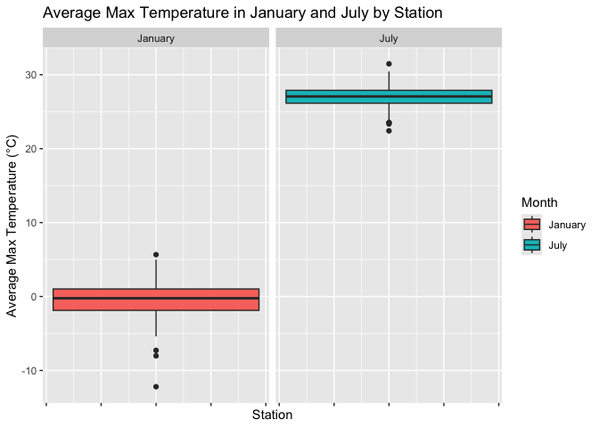
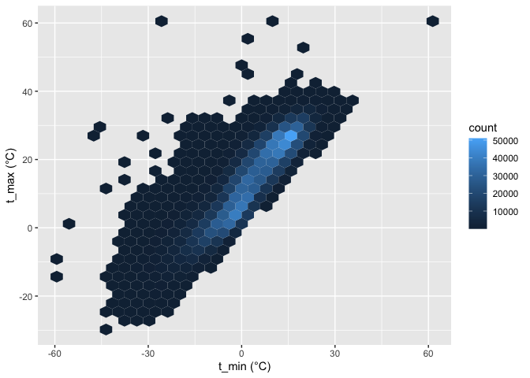
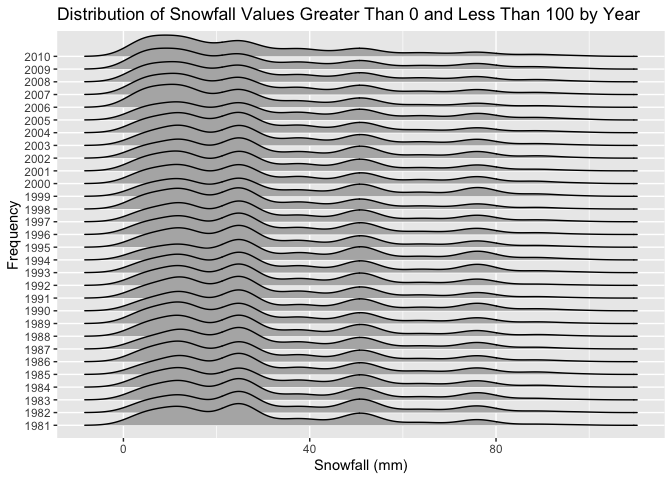
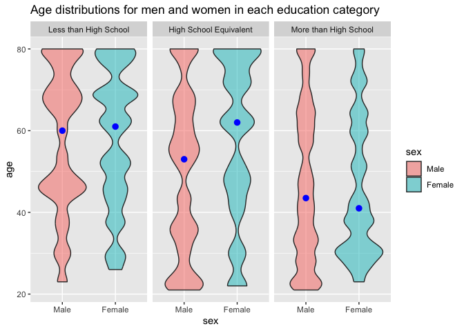
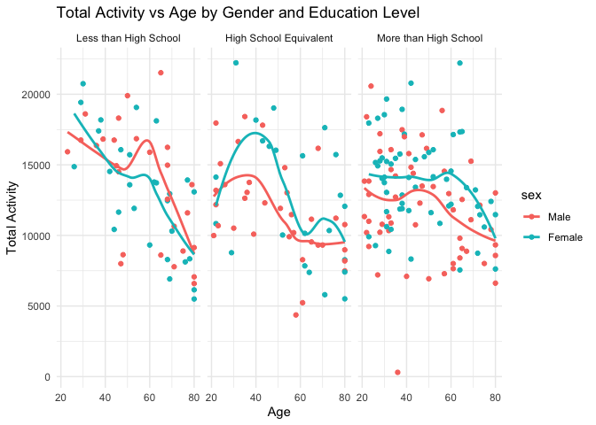
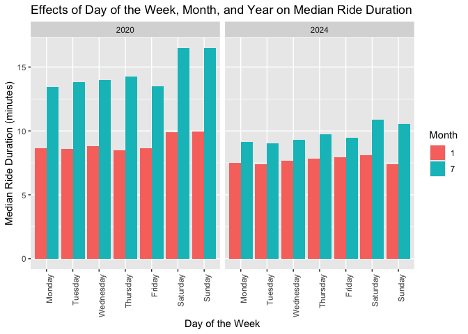
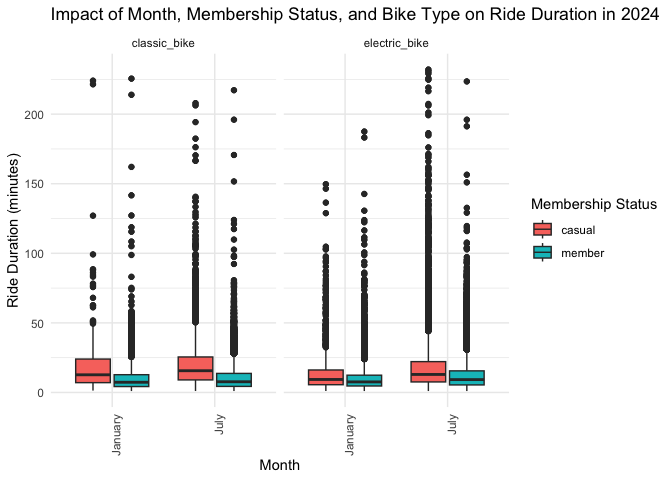

p8105_hw3_yx2954
================
Yiran Xu
2024-10-10

# Problem 1

## First, let’s take a few minutes to understand the dataset and the variables it contains.

``` r
str(ny_noaa)
```

    ## tibble [2,595,176 × 7] (S3: tbl_df/tbl/data.frame)
    ##  $ id  : chr [1:2595176] "US1NYAB0001" "US1NYAB0001" "US1NYAB0001" "US1NYAB0001" ...
    ##  $ date: Date[1:2595176], format: "2007-11-01" "2007-11-02" ...
    ##  $ prcp: int [1:2595176] NA NA NA NA NA NA NA NA NA NA ...
    ##  $ snow: int [1:2595176] NA NA NA NA NA NA NA NA NA NA ...
    ##  $ snwd: int [1:2595176] NA NA NA NA NA NA NA NA NA NA ...
    ##  $ tmax: chr [1:2595176] NA NA NA NA ...
    ##  $ tmin: chr [1:2595176] NA NA NA NA ...
    ##  - attr(*, "spec")=
    ##   .. cols(
    ##   ..   id = col_character(),
    ##   ..   date = col_date(format = ""),
    ##   ..   prcp = col_integer(),
    ##   ..   snow = col_integer(),
    ##   ..   snwd = col_integer(),
    ##   ..   tmax = col_character(),
    ##   ..   tmin = col_character()
    ##   .. )

``` r
nrow(ny_noaa)
```

    ## [1] 2595176

``` r
ncol(ny_noaa)
```

    ## [1] 7

``` r
n_station = 
  ny_noaa |>
  pull(id) |>
  n_distinct()

date_range = ny_noaa |>
  pull(date) |>
  range(na.rm = TRUE)
```

## Next, check the range of key variables

### Prcp

``` r
max_prcp_info = ny_noaa |>
  filter(prcp == max(prcp, na.rm = TRUE)) |>
  select(id, date, prcp)

min_prcp_info = ny_noaa |>
  filter(prcp == min(prcp, na.rm = TRUE)) |>
  select(id, date, prcp)
```

### Snow & snwd

``` r
max_snow_info = ny_noaa |>
  filter(snow == max(snow, na.rm = TRUE)) |>
  select(id, date, snow)

min_snow_info = ny_noaa |>
  filter(snow == min(snow, na.rm = TRUE)) |>
  select(id, date, snow)

max_snwd_info = ny_noaa |>
  filter(snwd == max(snwd, na.rm = TRUE)) |>
  select(id, date, snwd)

min_snwd_info = ny_noaa |>
  filter(snwd == min(snwd, na.rm = TRUE)) |>
  select(id, date, snwd)
```

### Tmax & tmin

``` r
max_tmax_info = ny_noaa |>
  mutate(tmax = as.numeric(tmax)) |>
  filter(tmax == max(tmax, na.rm = TRUE)) |>
  select(id, date, tmax, tmin)

min_tmax_info = ny_noaa |>
  mutate(tmax = as.numeric(tmax)) |>
  filter(tmax == min(tmax, na.rm = TRUE)) |>
  select(id, date, tmax, tmin)

max_tmin_info = ny_noaa |>
  mutate(tmin = as.numeric(tmin)) |>
  filter(tmin == max(tmin, na.rm = TRUE)) |>
  select(id, date, tmin)

min_tmin_info = ny_noaa |>
  mutate(tmin = as.numeric(tmin)) |>
  filter(tmin == min(tmin, na.rm = TRUE)) |>
  select(id, date, tmin)
```

## Then, count missing info

``` r
na_snow = ny_noaa |>
  filter(is.na(snow)) |>
  count() 

na_snwd = ny_noaa |>
  filter(is.na(snwd)) |>
  count()

na_tmax = ny_noaa |>
  filter(is.na(tmax)) |>
  count()

na_tmin = ny_noaa |>
  filter(is.na(tmin)) |>
  count()
```

## Description

- The table size is **2595176** by **7**. Variables includes **id** (the
  identifier for specific weather station), **date**,
  **prcp(precipitation)**, **snow(snowfall)**, **snwd(snow depth in
  millimeters)**, **maximum and minimun temperature**.
- This table contains data from **747** distinct stations in total from
  **1981-01-01** to **2010-12-31**.
- The maximum precipitation was **22860** observed on **1982-08-20** at
  **USC00306839**. The minimum is **0**, as expected. There were
  **1471511** days without raning.
- The maximum snowfall was **10160** on **1983-04-11** at
  **USC00309516**, while the minimum was **-13** on **2005-06-15** at
  **USC00307400**. An recording error may occur on that day as the
  snowfall cannot be negative.
- The maximum snow depth was **9195** observed on **1989-02-19** at
  **USC00308248**. The minimum is **0** as expected. There were
  **1621683** days without snow accumulation.
- The maximum tmax was **600** observed on **34** different days. The
  minimum was **-389** observed on **1995-02-07** at **USC00306184**.
- The maximum tmin was **600** on **30** different days. The minimum was
  **-594** on **2004-12-20** at **USR0000NSCH**
- There is a high degree of missing information in the table. For snow
  and snwd, about **14.69%** and **22.8%** are missing information,
  respectively. **43.71%** and **43.71%** of max and min temperature are
  missing.

## Data cleaning

- Clean name;
- Convert tmax and tmin to numeric data;
- Keep temperature, precipitation, snowfall in reasonable units
- Create seperate columns for year, month and day
- Remove error, i.e. tmax \<= tmin; snow \< 0;
- Remove empty row

``` r
ny_noaa_clean = ny_noaa |>
  janitor::clean_names() |>
  mutate(tmax = as.numeric(tmax) / 10, 
         tmin = as.numeric(tmin) / 10,
         prcp = prcp / 10,
         year = year(date),
         month = month(date),
         day = day(date)) |> 
  select(year, month, day, everything(), -date) |>
  filter(tmax > tmin | is.na(tmax) | is.na(tmin)) |>
  filter(snow >= 0 | is.na(snow)) |>
  filter(!(is.na(snow) & is.na(snwd) & is.na(tmax) & is.na(tmin) & is.na(prcp))) |>
  rename(
    tmax_c = tmax,     
    tmin_c = tmin,     
    prcp_mm = prcp,   
    snow_mm = snow,    
    snwd_mm = snwd     
  )
```

## Count most common snowfall

``` r
ny_noaa_clean |> 
  count(snow_mm) |>
  arrange(desc(n)) 
```

    ## # A tibble: 281 × 2
    ##    snow_mm       n
    ##      <int>   <int>
    ##  1       0 2007240
    ##  2      NA  308654
    ##  3      25   30981
    ##  4      13   23082
    ##  5      51   18253
    ##  6      76   10159
    ##  7       8    9959
    ##  8       5    9742
    ##  9      38    9186
    ## 10       3    8786
    ## # ℹ 271 more rows

For snowfall, the most commonly observed values is 0mm among with
2007240 observations, as there is no snow in most of the days.

## Make two-panel plot

### Filter and group data

``` r
avg_tmax_df = 
  ny_noaa_clean |>
  filter(month %in% c(1, 7) & !is.na(tmax_c)) |>
  group_by(id, month) |>
  summarise(avg_tmax = mean(tmax_c))
```

    ## `summarise()` has grouped output by 'id'. You can override using the `.groups`
    ## argument.

### Make plot

``` r
avg_tmax_p = ggplot(avg_tmax_df, aes(y = avg_tmax, fill = factor(month, labels = c("January", "July")))) +
  geom_boxplot() +  
  facet_grid(.~ month, labeller = labeller(month = c(`1` = "January", `7` = "July"))) +
  labs(title = "Average Max Temperature in January and July by Station",
       x = "Station",
       y = "Average Max Temperature (°C)",
       fill = "Month") +
  theme(axis.text.x = element_blank()) 

avg_tmax_p
```

<!-- -->

``` r
#ggsave(filename = "data/plots/avg_tmax.png", avg_tmax_p)
```

It can be noticed that the average max temperature in January is greatly
lower than that in July. Outliers in both panel can be detected. The
average temperature in some station significantly higher or lower than
the mean.

## Make other plots

### Geom_hex

``` r
hex_p = ggplot(ny_noaa_clean, aes(x = tmin_c, y = tmax_c)) + 
  geom_hex() + 
  labs(x = "t_min (°C)",
       y = "t_max (°C)")

hex_p
```

    ## Warning: Removed 1063998 rows containing non-finite outside the scale range
    ## (`stat_binhex()`).

<!-- -->

``` r
#ggsave(filename = "data/plots/tmax_tmin.png", hex_p)
```

### Ridge plot

``` r
ridge_p = ny_noaa_clean |>
  filter(snow_mm > 0 & snow_mm< 100) |>
  ggplot(aes(x = snow_mm, y = as.factor(year))) + 
  geom_density_ridges() +
  labs(
    x = "Snowfall (mm)",
    y = "Frequency",
    title = "Distribution of Snowfall Values Greater Than 0 and Less Than 100 by Year"
  ) +
  scale_y_discrete(expand = expansion(add = c(1, 2)))

ridge_p
```

    ## Picking joint bandwidth of 3.76

<!-- -->

``` r
#ggsave(filename = "data/plots/snow_dist.png", ridge_p)
```

# Problem 2

## Load data

``` r
demo_df = read_csv("data/nhanes_covar.csv", na = c("NA", ".", ""), skip = 4) |>
  janitor::clean_names() 
```

    ## Rows: 250 Columns: 5
    ## ── Column specification ────────────────────────────────────────────────────────
    ## Delimiter: ","
    ## dbl (5): SEQN, sex, age, BMI, education
    ## 
    ## ℹ Use `spec()` to retrieve the full column specification for this data.
    ## ℹ Specify the column types or set `show_col_types = FALSE` to quiet this message.

``` r
acc_df = read_csv("data/nhanes_accel.csv", na = c("NA", ".", "")) |>
  janitor::clean_names() 
```

    ## Rows: 250 Columns: 1441
    ## ── Column specification ────────────────────────────────────────────────────────
    ## Delimiter: ","
    ## dbl (1441): SEQN, min1, min2, min3, min4, min5, min6, min7, min8, min9, min1...
    ## 
    ## ℹ Use `spec()` to retrieve the full column specification for this data.
    ## ℹ Specify the column types or set `show_col_types = FALSE` to quiet this message.

## Merge df

``` r
anti_join(demo_df, acc_df, by = "seqn")
```

    ## # A tibble: 0 × 5
    ## # ℹ 5 variables: seqn <dbl>, sex <dbl>, age <dbl>, bmi <dbl>, education <dbl>

``` r
merged_df = left_join(demo_df, acc_df, by = "seqn")
```

## Tidy & orgnize df

``` r
final_df = 
  merged_df |> 
  pivot_longer(cols = starts_with("min"),
               names_to = "minute",
               values_to = "acc") |>
  filter(age >= 21) |>
  drop_na(sex, age, bmi, education) |>
  mutate(
    sex = recode(sex, "1" = "Male", "2" = "Female"),
    education = recode(education, "1" = "Less than High School", "2" = "High School Equivalent", "3" = "More than High School"),
    sex = as_factor(sex), 
    education = fct_relevel(education, "Less than High School", "High School Equivalent", "More than High School"))
```

## reader-friendly table for the number of men and women in each education category

``` r
sex_edu = final_df |>
  group_by(sex, education) |>
  count()
```

## Visualization - age distribution

``` r
age_dist_p = final_df |>
  ggplot(aes(x = sex, y = age)) + 
  geom_violin(aes(fill = sex), alpha = .5) + 
  stat_summary(fun = "median", color = "blue") +
  facet_grid(. ~ education)

age_dist_p
```

    ## Warning: Removed 2 rows containing missing values or values outside the scale range
    ## (`geom_segment()`).
    ## Removed 2 rows containing missing values or values outside the scale range
    ## (`geom_segment()`).
    ## Removed 2 rows containing missing values or values outside the scale range
    ## (`geom_segment()`).

<!-- -->

``` r
#ggsave("data/plots/age_dist.png", age_dist_p)
```

## Comments:

- Within male group, the number of people with more than high school
  education background is more than those with high school equivalent,
  while the number of those with less than high school education
  background is the least. The numbers are **80640**, **50400**, and
  **38880**, respectively.
- Within the female group, the number of those with high school
  equivalent education background is the least, followed by those with
  less than high school, and more than high school education background.
  The numbers are **33120**, **40320**, and **84960**, respectively.
- Comparing the male group and the female group, there are more males
  with high school equivalent background; however, there are more
  females with less than high school and more than high school
  background.
- The age distribution across different education background is shown in
  the picture. In Less than High School group, more males are
  concentrated on the age of 45 and 70-80, while above 70 are the most
  common age for female. The median age in female group is slightly
  higher than the median in male group.
- In High School Equivalent group, more males are concentrated on the
  age of 20-35 and 50-70, while 60-80 are the most common age for
  female. The median age in female group is higher than the median in
  male group.
- In More than High School group, the age distribution is relatively
  even, while 25-35 are the most common age for female, which is greatly
  different to the previous two groups. The median age in female group
  is slightly lower than the median in male group.

## Total activity vs age

### Get total activity

``` r
sum_acc = 
  final_df |>
  group_by(seqn) |>
  summarize(total_acc = sum(acc, na.rm = TRUE)) |>
  left_join(final_df %>% distinct(seqn, age, sex, education), by = 'seqn')
```

### Make plot

``` r
acc_age = ggplot(sum_acc, aes(x = age, y = total_acc, color = sex)) +
  geom_point() +
  geom_smooth(se = FALSE) +
  facet_grid(. ~ education) +
  labs(title = "Total Activity vs Age by Gender and Education Level", x = "Age", y = "Total Activity") +
  theme_minimal()

acc_age
```

    ## `geom_smooth()` using method = 'loess' and formula = 'y ~ x'

<!-- -->

``` r
#ggsave("data/plots/acc_age.png", acc_age)
```

### Comments

- Although the points have a scattered distribution, it can be noticed
  that total activity decreases as age increases in general in all three
  groups.
- **Within Group**: Female with less than a high school background were
  more active overall than men, the opposite of the other two groups.
- **Across group**: Compared across groups, both male and female aged
  20 - 40 in more than high school group are less active than their
  peers in other groups, presumably because a higher proportion of these
  people working on office.
- Outliers can be detected in both High School Equivalent group and
  Higher than High School, with either apparently higher or lower total
  activity compare to others within the groups.

## acc VS mins

### Get acc distribution among t

``` r
acc_t_df = 
  final_df |>
  group_by(minute, sex, education) |>
  summarize(avg_acc_t = mean(acc, na.rm = TRUE)) |>
  mutate(minute = as.numeric(gsub("min", "", minute)))
```

    ## `summarise()` has grouped output by 'minute', 'sex'. You can override using the
    ## `.groups` argument.

### Make plot

``` r
acc_min = ggplot(acc_t_df, aes(x = minute, y = avg_acc_t, color = sex, education)) +
  geom_point(alpha = .2) +
  geom_smooth(aes(color = sex), se = FALSE) +
  facet_grid(education ~ .) +
  labs(title = "Average Activity vs Time by Gender and Education Level", x = "Minutes", y = "Average Activity") +
  theme(
    strip.text = element_text(size = 7)   
  )

acc_min
```

    ## `geom_smooth()` using method = 'gam' and formula = 'y ~ s(x, bs = "cs")'

<!-- -->

``` r
#ggsave("data/plots/acc_min.png", acc_min)
```

### Comments

- **General:** Across all education levels, participants exhibit a
  similar pattern of activity throughout the day. The activity level
  gradually increases in the morning, peaks in the middle of the day,
  and then declines during the evening. This trend suggests that
  population follow a normal daily rhythm, and mostly go to bed at
  minute 0.
- **Female VS Male:** In all education levels, there is a slight
  difference between the activity patterns of males and females. In
  general, male is less active than female during daytime, and tend to
  stay up late in the evening. According to the smooth trend, female has
  a higher peak value than male during daytime.
- **Education level:** There is barely an impact from education level,
  but it appears that people with less than high school background tend
  to have a slightly higher peak during daytime.

# Problem 3

## Import data, Clean, tidy data and describe data

### Import data

``` r
Jan_20 = 
  read_csv("data/citibike/Jan 2020 Citi.csv.zip") |>
  mutate(date = as.Date("2020-01-01"))
```

    ## Rows: 12420 Columns: 7
    ## ── Column specification ────────────────────────────────────────────────────────
    ## Delimiter: ","
    ## chr (6): ride_id, rideable_type, weekdays, start_station_name, end_station_n...
    ## dbl (1): duration
    ## 
    ## ℹ Use `spec()` to retrieve the full column specification for this data.
    ## ℹ Specify the column types or set `show_col_types = FALSE` to quiet this message.

``` r
Jan_24 = 
  read_csv("data/citibike/Jan 2024 Citi.csv.zip") |>
    mutate(date = as.Date("2024-01-01"))
```

    ## Rows: 18861 Columns: 7
    ## ── Column specification ────────────────────────────────────────────────────────
    ## Delimiter: ","
    ## chr (6): ride_id, rideable_type, weekdays, start_station_name, end_station_n...
    ## dbl (1): duration
    ## 
    ## ℹ Use `spec()` to retrieve the full column specification for this data.
    ## ℹ Specify the column types or set `show_col_types = FALSE` to quiet this message.

``` r
July_20 = read_csv("data/citibike/July 2020 Citi.csv.zip") |>
      mutate(date = as.Date("2020-07-01"))
```

    ## Rows: 21048 Columns: 7
    ## ── Column specification ────────────────────────────────────────────────────────
    ## Delimiter: ","
    ## chr (6): ride_id, rideable_type, weekdays, start_station_name, end_station_n...
    ## dbl (1): duration
    ## 
    ## ℹ Use `spec()` to retrieve the full column specification for this data.
    ## ℹ Specify the column types or set `show_col_types = FALSE` to quiet this message.

``` r
July_24 = read_csv("data/citibike/July 2024 Citi.csv.zip") |>
      mutate(date = as.Date("2024-07-01"))
```

    ## Rows: 47156 Columns: 7
    ## ── Column specification ────────────────────────────────────────────────────────
    ## Delimiter: ","
    ## chr (6): ride_id, rideable_type, weekdays, start_station_name, end_station_n...
    ## dbl (1): duration
    ## 
    ## ℹ Use `spec()` to retrieve the full column specification for this data.
    ## ℹ Specify the column types or set `show_col_types = FALSE` to quiet this message.

### Clean, and tidy data

``` r
rides_df = 
  bind_rows(Jan_20, Jan_24, July_20, July_24) |>
  distinct() |>
  janitor::clean_names() |>
  pivot_longer(
    start_station_name: end_station_name,
    names_to = "station_status", values_to = "station_name",
    names_pattern = "(start|end)_station_name") 
```

### Description

``` r
ride_types =
  rides_df |>
  pull(rideable_type) |>
  unique()
```

``` r
most_day =
  rides_df |>
  count(weekdays) |>
  arrange(desc(n))
```

``` r
avg_time =
  rides_df |>
  pull(duration) |>
  mean(na.rm = TRUE)
```

``` r
num_member = 
  rides_df |>
  count(member_casual)
```

- The combine dataset contains **198970** order information, including
  order id, bike types, order data, order duration, member status, start
  and end location.
- Types of bikes includes: **classic_bike** and **electric_bike**
- On **Wednesday**, citibike get the most orders **(33768)**.
- The average duration for a single order is **13.9301375**.
- For all order, **80.2754184%** are from members.

## Total number of rides in each combination of year and month

``` r
num_rides_df = 
  rides_df |>
  group_by(date, member_casual) |> 
  distinct(ride_id) |>
  count() |>
  pivot_wider(
    names_from = member_casual, values_from = n) 
```

### Comments

- on January 2020, most of riders are members, the proportion reached
  **0.9207729**. There was a outbreak in casual rider number from
  2020-01 to 2020-07, while the number of members slightly but
  continiously growing. From 2020-07 to 2024-01, the proportion of
  member increased, presumably casual customer were becoming members,
  though the total number of order decreases. From 2024-01 to 2024-07,
  there was another outbreak in both casual rider and member rider. The
  number of member consistently growed from 2020-01 to 2024-07.

## 5 popular start station for July 2024

``` r
most_start = rides_df |>
  filter(station_status == "start") |>
  group_by(date, station_name) |>
  count() |>
  arrange(desc(n))
```

The 5 most popular starting stations for July 2024 are: Pier 61 at
Chelsea Piers: 163 rides; University Pl & E 14 St: 155 rides; W 21 St &
6 Ave: 152 rides; West St & Chambers St: 150 rides; W 31 St & 7 Ave: 146
rides.

## Median duration

### Make median_df

``` r
med_dur_df = 
  rides_df |>
  mutate(
    year = year(date),
    month = as.character(month(date)),
    day = fct_relevel(weekdays, "Monday", "Tuesday", "Wednesday", "Thursday", "Friday", "Saturday", "Sunday")) |>
  group_by(year, month, day) |>
  summarize(med_dur = median(duration, na.rm = TRUE))
```

    ## `summarise()` has grouped output by 'year', 'month'. You can override using the
    ## `.groups` argument.

### Make plot

``` r
date_med_p = ggplot(med_dur_df, aes(x = day, y = med_dur, fill = month)) +
  geom_bar(stat = 'identity', position = position_dodge()) +
  facet_grid(. ~ year) +
  labs(title = 'Effects of Day of the Week, Month, and Year on Median Ride Duration',
       x = 'Day of the Week',
       y = 'Median Ride Duration (minutes)',
       fill = 'Month') +
  theme(axis.text.x = element_text(angle = 90, hjust = 1))

date_med_p
```

<!-- -->

### Comments

- **Days of week**: The median of duration is higher in weekend than in
  weekdays. This is true for 2020-01, 2020-07, and 2024-07, while the
  trend is not as apparent in 2024-01, where the median of duration is
  only slightly higher on Saturday. This suggests that people have more
  free time on weekends than weekdays.
- **Month**: The median of duration on January is is smaller than July
  in 2020, while the difference became slower in 2024. This could imply
  that people are less likely to ride a bike in cold winter.
- **Year**: The median of duration in July, 2024 is approximately the
  same as that in July, 2020, while there is a huge difference in median
  on July in different years. This implies that there could be an
  alternative way of transportation during summer.

## duration distribution

### Make dist_df

``` r
dist_df = 
  rides_df |>
  mutate(
    month = factor(format(date, '%m'), levels = c('01', '07'), labels = c('January', 'July')), 
    year = year(date)) |>
  filter(year == "2024")
```

### Make plot

``` r
dur_dist_p = ggplot(dist_df, aes(x = month, y = duration, fill = member_casual)) +
  geom_boxplot() +
  facet_grid(. ~ rideable_type, scales = 'free') +
  labs(title = 'Impact of Month, Membership Status, and Bike Type on Ride Duration in 2024',
       x = 'Month',
       y = 'Ride Duration (minutes)',
       fill = 'Membership Status') +
  theme_minimal() +
  theme(axis.text.x = element_text(angle = 90, hjust = 1))

dur_dist_p
```

<!-- -->

### Discussion

- **General**: Plenty of outliers are detected near all boxes,
  suggesting a variability in duration. It worth noting that the
  electric bike group is more likely to have outlier in very long
  duration. This may be the case as electric bike is less
  energy-demanding.
- **Impact of month**: For both bike types and membership, status, the
  ride duration tends to be slightly higher in July compared to January.
- **Membership status**: Members generally have shorter and more
  consistent ride duration, as indicated by the thinner box that is
  lower in member group than in casual group. Casual users display a
  wider range of ride duration, suggesting more variability in usage
  patterns.
- **Bike type**: The duration is slightly higher in classic bike group
  than in electric bike. Besides, the duration is slightly more
  consistent in electric bike group. These suggest electric might be
  faster than classic bike and therefore cut down the time on road.
